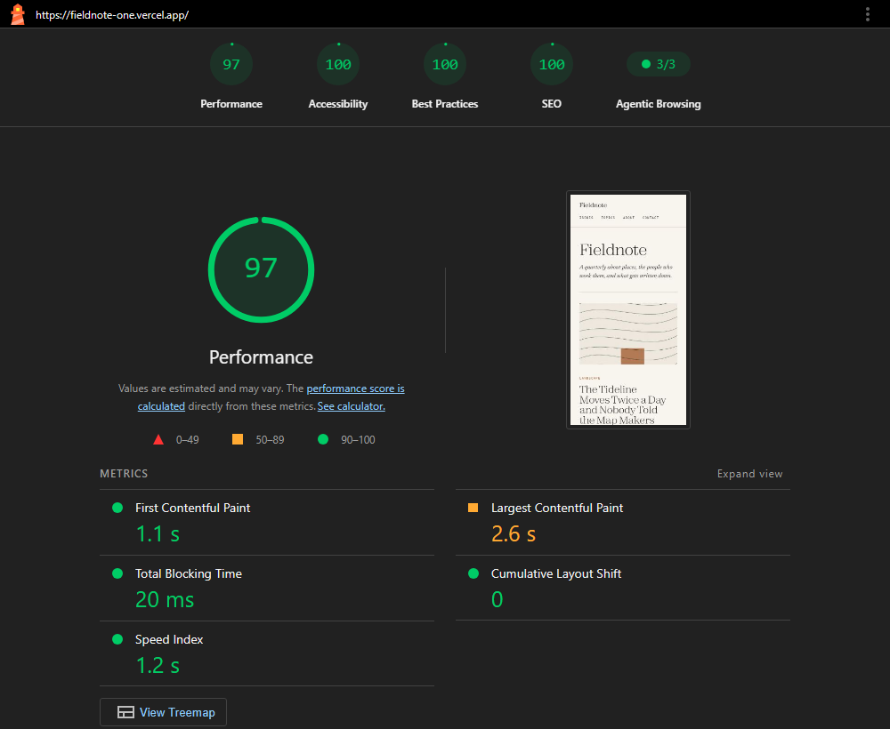
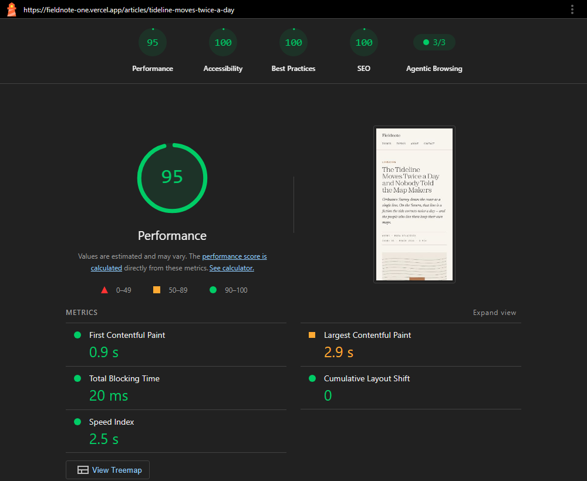

# Fieldnote

A magazine site: [Next.js](https://nextjs.org) App Router on the front, [Sanity](https://www.sanity.io) for the content, both served from one deployment.

The Studio is embedded at `/studio` rather than hosted separately, so there is one deploy, one domain, and one thing for an editor to bookmark.

**Live site:** <https://fieldnote-one.vercel.app>
**Studio:** <https://fieldnote-one.vercel.app/studio>

## Lighthouse

Measured against the live URL, not localhost, on Lighthouse 13.4.1 with its
default mobile profile — simulated 4G and a 4x CPU slowdown.

| | Performance | Accessibility | Best Practices | SEO | Agentic Browsing |
| --- | --- | --- | --- | --- | --- |
| [Homepage](https://fieldnote-one.vercel.app) | 97 | 100 | 100 | 100 | 100 |
| [Article](https://fieldnote-one.vercel.app/articles/tideline-moves-twice-a-day) | 95 | 100 | 100 | 100 | 100 |

Homepage: FCP 1.1s, LCP 2.6s, TBT 20ms, CLS 0, Speed Index 1.2s.
Article: FCP 0.9s, LCP 2.9s, TBT 20ms, CLS 0, Speed Index 2.5s.

Agentic Browsing is the fifth category, new in Lighthouse 13 and still marked
as under development. It measures whether a page is legible to an automated
agent rather than only to a human reader or a search crawler: whether the
accessibility tree it exposes is well-formed enough to be navigated
programmatically, whether the layout is stable enough to act on, and whether
the site states its own structure in [`/llms.txt`](https://fieldnote-one.vercel.app/llms.txt).
That last audit reported nothing at all until the file existed.

Performance is the only category that moves between runs. Across three
measurements the homepage scored 97, 97 and 96, and the article 95, 97 and 97 —
Lighthouse's simulated throttling has a few points of variance, and the article
sits close enough to 95 that a slow run can dip below it. The other four
categories are 100 every time. The numbers above are from the run captured in
the screenshots.





Cumulative Layout Shift is 0 on both. That is worth stating carefully, because
an earlier version of this build also reported 0 for the wrong reason: the
typefaces were not rendering at all, so there was no font swap to shift
anything. With Zodiak, Newsreader and IBM Plex Mono actually applied, holding
CLS at 0 means the metric-matched fallbacks and the fixed-row header are doing
their job.

## Studio demo access

> **TODO — Rhys to create a viewer-role user in Sanity and paste here.**
>
> A read-only account so anyone can open the Studio, click through the content
> model and see the validation and previews, without being able to change
> anything. Sanity → Members → Invite, role Viewer.

## Getting started

```bash
npm install
cp .env.example .env.local   # then fill it in, see below
npm run dev                  # http://localhost:3001
npm run seed                 # content to build against
```

`dev` and `build` both run `scripts/fetch-fonts.mjs` first, which downloads the
display face into `app/fonts/`. That needs a network connection the first time
and then never again. The face is Zodiak, from Fontshare: free for commercial
use, but its licence permits self-hosting rather than redistribution, and it
names public repositories specifically — so this one does not carry the file.
The same licence forbids subsetting, which is why the woff2 ships whole.

### Environment

| Variable | Needed for | Where it comes from |
| --- | --- | --- |
| `NEXT_PUBLIC_SANITY_PROJECT_ID` | everything | [sanity.io/manage](https://www.sanity.io/manage) |
| `NEXT_PUBLIC_SANITY_DATASET` | everything | `production` |
| `NEXT_PUBLIC_SANITY_API_VERSION` | everything | a date; pinning it is what stops Sanity changing behaviour under you |
| `SANITY_API_READ_TOKEN` | reads and draft mode | API → Tokens → **Viewer** |
| `SANITY_REVALIDATE_SECRET` | the publish webhook | any long random string |
| `SANITY_API_WRITE_TOKEN` | `npm run seed` only | API → Tokens → **Editor** |

The two `NEXT_PUBLIC_` values reach the browser and are safe there — they identify the dataset, they do not grant access to it. The rest are server-only and must never gain that prefix.

`SANITY_API_WRITE_TOKEN` is the one to be careful with: it can change anything in the dataset, nothing at runtime reads it, and it should be revoked once the dataset is populated.

You also need your local URL registered as a CORS origin — API → CORS origins → `http://localhost:3001`, credentials allowed — or the Studio cannot reach the dataset.

## Scripts

| | |
| --- | --- |
| `npm run dev` | dev server on port 3001 |
| `npm run build` | production build |
| `npm run start` | serve the production build |
| `npm run lint` | eslint |
| `npm run seed` | populate the dataset (needs the Editor token) |
| `node scripts/fetch-fonts.mjs` | fetch the display face; `dev` and `build` do it for you |

The dev port is pinned to 3001 rather than left at 3000, so the CORS origin registered with Sanity stays correct even when something else has taken 3000.

### After changing a schema or a query

```bash
npx sanity schema extract --path sanity/extract.json --force --enforce-required-fields
npx sanity typegen generate
```

This writes `sanity/lib/generated.ts`, from which every result type in `sanity/lib/types.ts` is derived. `types.ts` only names things; it describes nothing. A hand-maintained copy of those shapes drifts from the queries silently, and the first symptom is a page rendering `undefined` in production.

`--enforce-required-fields` matters: without it every field comes out nullable, including the ones the schema marks required, and the app fills with guards against absences that validation already prevents.

## How it fits together

```text
app/
  (site)/          the site proper — everything here gets the header and footer
  studio/          the embedded Studio, deliberately outside (site)
  api/             revalidation webhook, draft mode on and off
  components/      Portable Text, riso artwork, index rows, byline, chrome
  lib/             site settings, metadata, date formatting
sanity/
  schemaTypes/     the content model — six document types, four custom blocks
  lib/             client, queries, generated types, the draft-aware fetch
scripts/
  seed.mts         the seed described above
  fetch-fonts.mjs  pulls the display face in, and explains why it is not here
```

### Imagery is generated, not stored

`app/components/RisoArt.tsx` takes a seed string — usually a slug — and returns two-colour abstract artwork. Every article gets a distinct, deterministic image with nothing to upload, no asset to manage and no stock photograph to credit. The same seed gives the same picture on the server, on the client, this build and the next.

Three things stop it reading as procedural, in order of effect:

- **Misregistration.** Real risograph printing offsets each colour layer by a millimetre or two because the paper shifts between passes. The second layer here is offset a few pixels on both axes, varied per seed. This one change is most of the difference between "print" and "vector art".
- **Ink density.** Shapes take opacities across a range rather than one flat value, and edges sit slightly off their mathematical positions.
- **Grain.** A turbulence overlay at a few percent, which is the paper showing through.

There is consequently no cover image field on an article or an issue, and no author portrait. A required field that must never be filled would show a validation error on every document, and one staff photograph on a site with no other photography reads as an accident. Author pages are typographic.

Uploaded images still exist in two places, because generated artwork is the wrong answer for both: pictures an editor places inside an article body, and the social share image, which has to be a raster URL a third-party crawler can fetch.

### Caching

Nothing revalidates on a timer. An article is not stale sixty seconds after it was fetched; it is stale when an editor changes it. Responses are cached indefinitely and tagged by document type and identity (`article`, `article:some-slug`), and the webhook at `/api/revalidate` clears the matching tags when Sanity says something was published.

Tags expire outright rather than using Next's recommended `'max'` profile. A cache-life profile serves the stale copy while fetching fresh data behind it, so the editor who just hit publish reloads the page, sees the old version, and reasonably concludes the webhook is broken. The cost is one slower request for the next visitor.

Pages tag the document types they render, not only their own. The byline, the topic names and the issue number on an article page all come from referenced documents, so renaming an author has to invalidate the articles they wrote.

To set the webhook up: sanity.io/manage → API → Webhooks, pointed at `https://your-domain/api/revalidate`, with the shared secret, the filter `!(_id in path("drafts.**"))` so draft saves do not blow the cache away every few keystrokes, and the projection `{_type, "slug": slug.current}`.

### Draft mode

`sanityFetch` has two modes. For a reader it caches and tags as above. In draft mode it reads the drafts perspective, caches nothing, and turns on stega — invisible characters encoding document and field ids into the text, which is how a click on the rendered page maps back to a field in the Studio. Stega is enabled per request rather than on the client, because those characters are corruption in published output: they travel into copied text and search results.

`generateStaticParams` uses `sanityFetchPublished`, which never consults draft mode. It runs at build time with no HTTP request behind it, so `draftMode()` throws there rather than merely returning false — and which pages to prerender is a published-content question regardless.

Reading `draftMode()` does not force dynamic rendering. Every content page still prerenders; Next bypasses the static cache only when the cookie is present.

### Other things worth knowing

**The Studio sits outside the `(site)` route group.** The root layout is `html`, `body` and the fonts and nothing else. Anything added there is drawn around the Studio too, which is how a site header ends up on top of the Studio's own interface.

**Alt text is required by the schema.** An empty `alt` in a component therefore means the image is decorative, not that somebody forgot. The generated artwork is `aria-hidden`: it carries nothing a caption does not already say.

**Motion.** The only transition is 150ms on link colour. Nothing animates on scroll. `prefers-reduced-motion` is honoured globally rather than per component, so anything added later inherits the rule instead of having to remember it.

**Reading time** is computed in GROQ with `pt::text`, in one place, rather than by shipping article bodies to the client to count words.

## The seed content

`npm run seed` writes nine articles, two issues, three contributors, four topics and two pages. It is safe to re-run: fixed document ids written with `createOrReplace`, and assets Sanity dedupes by content hash.

The content is deliberately uneven, and that is the point. The pieces run from 520 words to 24 — full reports, short notes and a single-paragraph fragment — because a real magazine is not twelve pieces of identical length, and that evenness is itself a tell. One article belongs to no issue and no topic, one contributor has no links, one topic has no description. Seed data where every field is filled makes every layout look fine, and the gaps are where layouts break.

It is placeholder writing all the same. Before this goes in front of anyone, replace at least a couple of the pieces with something written by hand: fluent, evenly-paced prose is what a design-led readership notices first.
